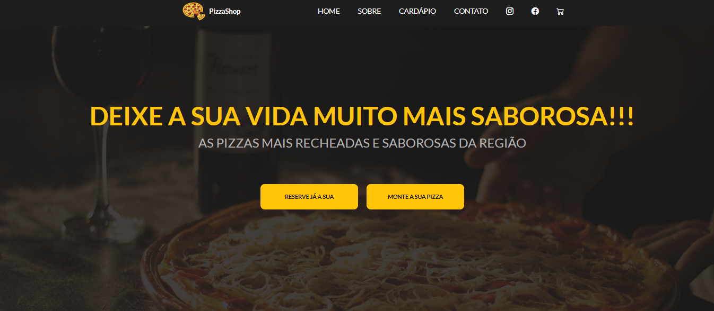
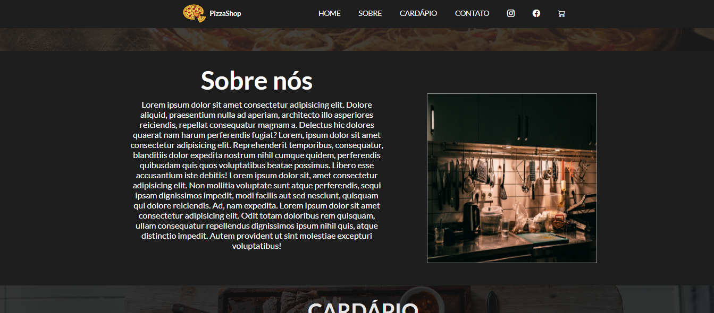
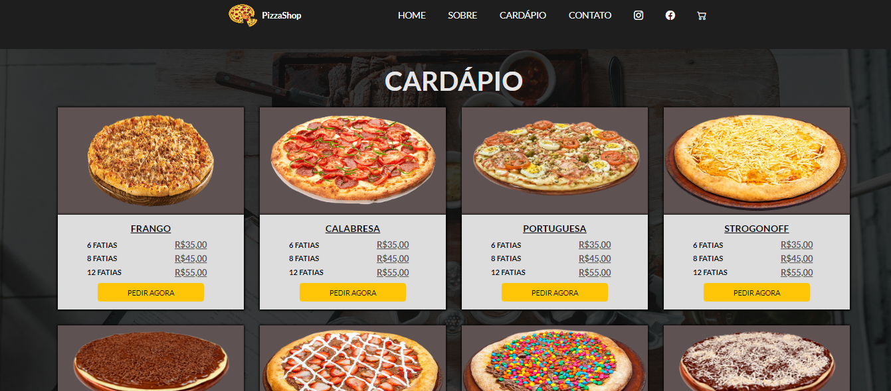
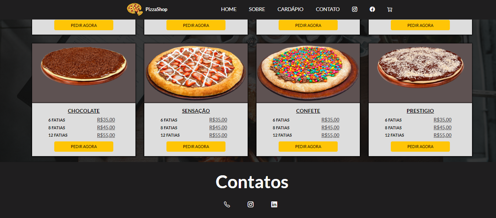

<h1> Projeto Site Fictício de uma Pizzaria </h1>
 
 
<h2>O projeto que desenvolvi é um site fictício para uma pizzaria, projetado para proporcionar uma experiência gastronômica envolvente e atrativa aos visitantes. Com um design apetitoso e funcionalidades interativas, o site oferece um cardápio variado com uma ampla seleção de sabores de pizzas.     
Recursos Principais:   

Cardápio Interativo de Pizzas: O site apresenta um cardápio completo com uma variedade de sabores de pizzas. Os visitantes podem explorar os diferentes sabores disponíveis e imagens atraentes de cada pizza.

Design Atraente e Responsivo: O site é projetado com um layout visualmente atraente e responsivo, garantindo uma experiência consistente e agradável em uma variedade de dispositivos, desde desktops até smartphones. Elementos de design cuidadosamente selecionados, como cores vibrantes e imagens apetitosas, contribuem para criar uma atmosfera convidativa e apetitosa.

Tecnologias Utilizadas:

HTML5: Utilizado para criar a estrutura do site, incluindo a organização do conteúdo e a definição dos elementos do cardápio e do formulário de pedidos.

CSS3: Responsável pelo estilo e design do site, garantindo uma apresentação visual atraente e uma experiência de usuário intuitiva.

JavaScript: Utilizado para implementar funcionalidades interativas, como a personalização de pedidos, o sistema de pedidos online e a integração de animações e efeitos visuais.

Conclusão:

O site fictício da pizzaria que desenvolvi oferece uma experiência completa e imersiva aos clientes, combinando um cardápio variado com funcionalidades interativas e um design visualmente atraente. Com uma abordagem centrada no cliente e tecnologias web modernas, o site promove a marca da pizzaria de forma eficaz e proporciona uma experiência gastronômica única e memorável aos visitantes.

 
 
  <h3> Tecnologias Utilizadas </h3>
     
    
    
  
 

